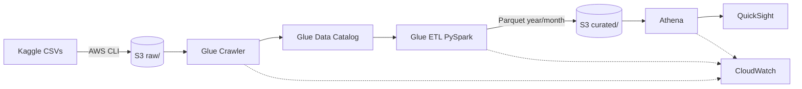

# Smart Meter Health Monitoring & Energy Consumption Analytics — AWS Data Lake

A production-style AWS data lake for an Indian DISCOM that ingests CEEW smart-meter
interval data (Bareilly + Mathura, 2019–2021, **21.4M readings, ~1.1 GB CSV**),
curates it with Glue PySpark, and serves meter-health and consumption analytics —
including **SQL-based consumption prediction** and QuickSight ML forecasting —
through Athena and QuickSight.

## Architecture



Details: [architecture/architecture.md](architecture/architecture.md)

## Repository layout

| Path | Contents |
|---|---|
| `scripts/download_dataset.py` | Kaggle download + extract + verify |
| `scripts/preprocess.py` | Local validation/cleaning (Part 4) |
| `glue/glue_etl.py` | Glue 4.0 PySpark job: clean, enrich, health rules, Parquet |
| `athena/queries.sql` | DDL + 28 business queries |
| `athena/insights.sql` | Prediction (regression forecasts) + anomaly/theft/outage/segmentation insights |
| `quicksight/dashboard_design.md` | 3-sheet dashboard spec incl. ML forecast widgets |
| `docs/` | data dictionary, runbook, IAM, CloudWatch, cost, best practices |
| `terraform/` | optional IaC for bucket/database/crawler/job |

## Prerequisites

- AWS account + CLI v2 configured (region `us-east-1` used throughout)
- Python 3.10+, `pip install kaggle pandas pyarrow`
- Kaggle API token; QuickSight subscription (trial OK)

## Deployment (condensed — full commands in [docs/runbook.md](docs/runbook.md))

```bash
# 1. Data
python scripts/download_dataset.py && python scripts/preprocess.py

# 2. Lake
BUCKET=meter-health-demo-$(aws sts get-caller-identity --query Account --output text)
aws s3 mb s3://$BUCKET
aws s3 cp datasets/ s3://$BUCKET/raw/meter_readings/ --recursive --exclude "*" --include "*.csv"
aws s3 cp glue/glue_etl.py s3://$BUCKET/scripts/

# 3. Catalog
aws glue create-database --database-input '{"Name":"meter_health_db"}'
aws glue create-crawler --name meter-raw-crawler --role <GLUE_ROLE> \
  --database-name meter_health_db --table-prefix raw_ \
  --targets '{"S3Targets":[{"Path":"s3://'$BUCKET'/raw/meter_readings/"}]}'
aws glue start-crawler --name meter-raw-crawler

# 4. ETL
aws glue create-job --name smart-meter-curation ...   # see runbook Day 2
aws glue start-job-run --job-name smart-meter-curation

# 5. Athena: run DDL + MSCK REPAIR from athena/queries.sql, then the 28 queries
# 6. QuickSight: build per quicksight/dashboard_design.md
```

## What the curated table adds

Time attributes (`year..hour`, `day_of_week`, `is_weekend`), `power_kw`,
voltage/current/power bands, and per-reading **health_score (0–100)** +
**health_status** (`HEALTHY / WARNING / CRITICAL / HIGH_LOAD / POSSIBLE_METER_ISSUE`)
per DISCOM business rules (over-voltage > 240 V, under-voltage < 200 V,
over-current > 9 A, energized-but-zero-consumption).

## Cleanup

```bash
aws glue delete-job --job-name smart-meter-curation
aws glue delete-crawler --name meter-raw-crawler
aws glue delete-database --name meter_health_db
aws athena delete-work-group --work-group meter-health-wg --recursive-delete-option
aws s3 rb s3://$BUCKET --force
# QuickSight: delete dashboard/dataset or cancel subscription
```

## Future enhancements

- Kinesis/IoT Core streaming ingestion for near-real-time health alerts
- Lake Formation fine-grained (row/column) governance
- Step Functions/Glue workflows orchestration; dbt-style tests on curated zone
- SageMaker anomaly models (beyond SQL/QuickSight ML) once allowed
- Apache Iceberg table format for ACID upserts and time travel
