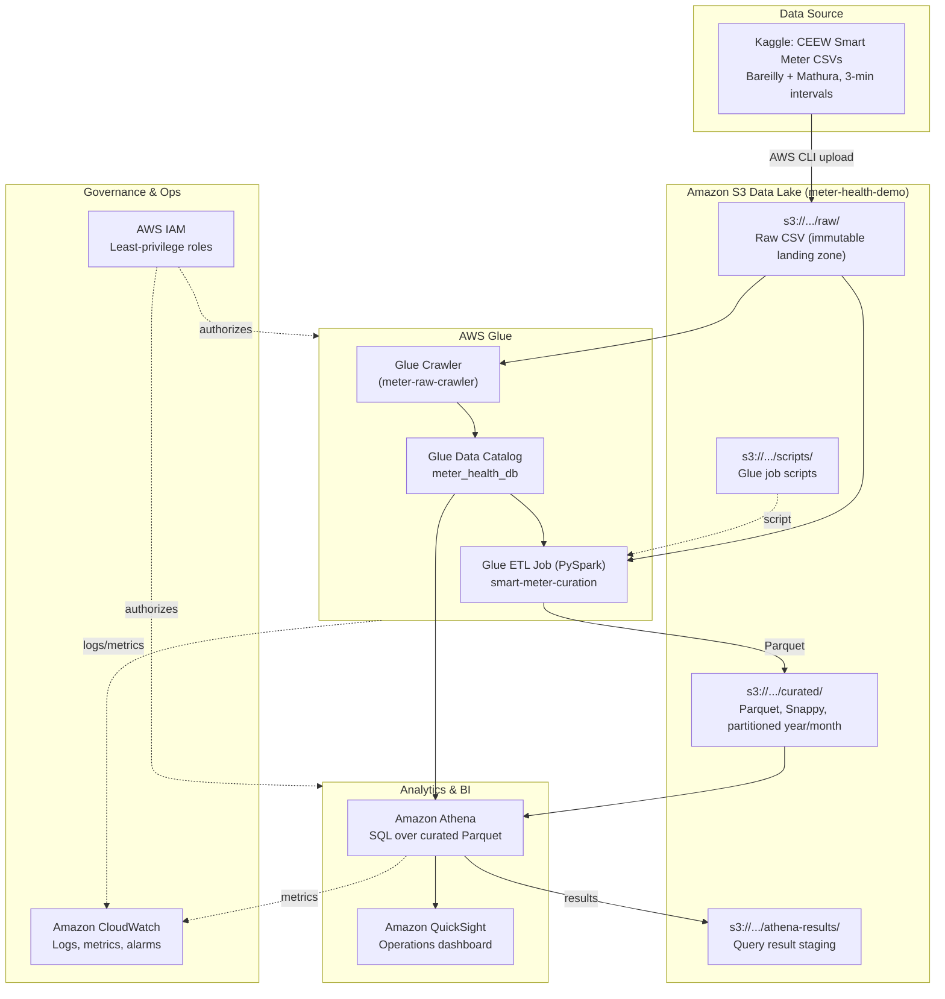

# AWS Architecture — Smart Meter Health Monitoring Data Lake

## Architecture Diagram

## Data Flow (step by step)

1. **Ingest** — CEEW smart-meter CSVs (downloaded from Kaggle) are uploaded with the
   AWS CLI to the **raw zone** `s3://<bucket>/raw/`. Raw is immutable: files are
   never edited in place, only re-landed.
2. **Discover** — A **Glue Crawler** scans `raw/`, infers the CSV schema, and
   registers table `raw` in Glue Data Catalog database **meter_health_db**.
3. **Transform** — The **Glue ETL job** (PySpark, `glue/glue_etl.py`) reads via the
   catalog, deduplicates, drops nulls, enforces physical ranges, renames columns,
   derives time attributes, power, voltage/current/power bands, a 0–100
   `health_score`, and a `health_status` classification.
4. **Curate** — Output is written as **Snappy-compressed Parquet** to
   `curated/meter_readings/`, partitioned by `year` and `month`. A DDL statement
   (or a second crawler on `curated/`) registers `meter_readings_curated`.
5. **Query** — **Athena** runs serverless SQL directly on the curated Parquet;
   partition pruning + columnar format keep scans (and cost) small. Results are
   staged in `athena-results/`.
6. **Visualize** — **QuickSight** connects to Athena (SPICE import) and serves the
   operations dashboard: KPIs, consumption trends, health distribution, heat maps.
7. **Monitor & secure** — **CloudWatch** captures Glue/Athena logs and metrics with
   alarms on job, crawler, and query failures. **IAM** enforces least-privilege
   access per service.

## Service Roles

| Service | Role in this architecture |
|---|---|
| **Amazon S3** | Durable, cheap object store forming the lake's raw and curated zones plus script and query-result staging. |
| **AWS Glue Crawler** | Automatic schema inference over raw CSVs; keeps the catalog in sync as new files land. |
| **AWS Glue Data Catalog** | Central Hive-compatible metastore; single source of truth for schemas used by Glue ETL and Athena. |
| **AWS Glue ETL (PySpark)** | Serverless Spark for cleaning, enrichment, business rules, and CSV→Parquet conversion. No cluster to manage. |
| **Amazon Athena** | Serverless, pay-per-TB-scanned SQL engine for ad-hoc analysis and as the QuickSight data source. |
| **Amazon QuickSight** | Managed BI: executive KPIs, trends, and meter-health visuals for the DISCOM operations team. |
| **AWS IAM** | Least-privilege roles/policies for the Glue job, crawler, Athena users, and QuickSight service role. |
| **Amazon CloudWatch** | Centralized logs, metrics, and failure alarms for Glue jobs, crawlers, and Athena queries. |

## Zone design

| Zone | Path | Format | Purpose |
|---|---|---|---|
| Raw | `raw/` | CSV (as-landed) | Immutable source of truth; enables full reprocessing |
| Curated | `curated/` | Parquet + Snappy, partitioned `year/month` | Analytics-optimized, business-rule enriched |
| Scripts | `scripts/` | py | Glue job code, versioned via deployment |
| Athena results | `athena-results/` | CSV/metadata | Query result staging (lifecycle-expired after 30 days) |
